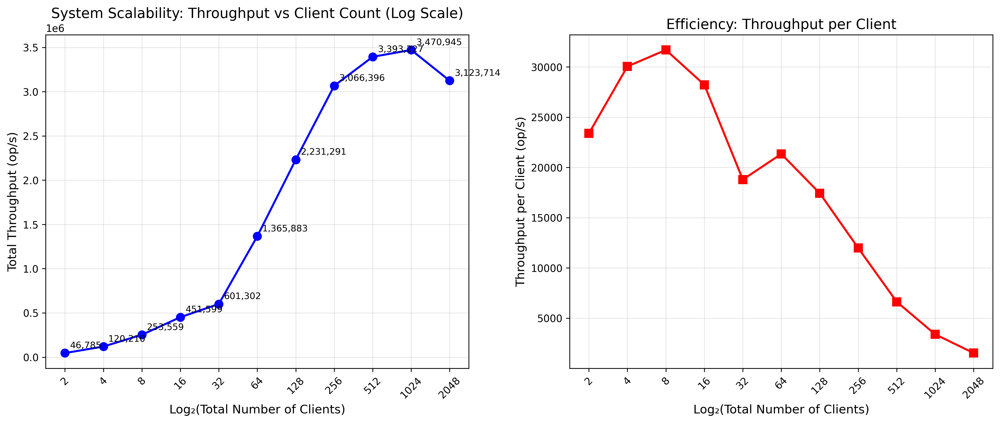

# High-Performance Key-Value Store

*Group members: Nafiur Rahman Khadem, Tuan D Le, Giang Ta, Sicheng Zhou*

## 1 Results

### With 4 nodes cluster

#### Final Throughput

```
Server nodes: node0 node1
Client nodes: node2 node3

node0 median 1761833 op/s
node1 median 1610980 op/s

total 3372813 op/s
```

#### Hardware Utilization

| Node | CPU Median (%) | Memory Median (%) | Network Median (%) |
|------|--------------|-----------------|------------------|
| Client 1 | 81.59% | 0.99% | 16.65% |
| Client 2 | 81.29% | 0.93% | 16.72% |
| Server 1 | 88.49% | 2.45% | 17.60% |
| Server 2 | 80.01% | 1.15% | 15.76% |

#### Scaling with increasing concurrent clients




### With 8 nodes cluster

#### Final Throughput

```
Server nodes: node0 node1 node2 node3
Client nodes: node4 node5 node6 node7

node0 median 1903520 op/s
node1 median 1653337 op/s
node2 median 1591488 op/sIt's OK
node3 median 1513968 op/s

total 6662312 op/sIt's OK
```

#### Hardware Utilization

| Node | CPU Median (%) | Memory Median (%) | Network Median (%) |
|------|--------------|-----------------|------------------|
| Client 1 | 83.99% | 0.96% | 17.95% |
| Client 2 | 84.49% | 0.94% | 17.33% |
| client 3 | 84.66% | 0.95% | 17.38% |
| client 4 | 84.35% | 0.95% | 17.61% |
| Server 1 | 87.29% | 2.45% | 20.31% |
| Server 2 | 81.34% | 1.14% | 17.50% |
| server 3 | 79.58% | 1.16% | 16.75% |
| server 4 | 79.76% | 1.15% | 15.91% |


## 2 Design

Our redesigned key-value store implements three major optimizations: **request batching**, **concurrent data structure improvements**, and **increased client parallelism**. The most significant change is the introduction of request batching on the client side, where Get requests are aggregated into batches of up to 1024 operations per host before being sent as a single BatchGet RPC. The server implements a corresponding BatchGet handler that processes multiple Get requests in a single RPC invocation. This batching strategy dramatically reduces network round-trips. The client maintains separate batch buffers for each host, ensuring batching doesn't introduce cross-host dependencies. Additionally, we replaced the server's traditional map with Go's sync.Map, which provides lock-free reads for frequently accessed keys and better handles concurrent access patterns. The client count was also increased from the default to 256 concurrent clients, allowing the system to generate sufficient load to saturate the server and fully utilize available CPU cores.

The rationale for these design choices stems from systematic performance analysis of different bottlenecks. Request batching addresses the dominant RPC overhead, where each call incurs fixed costs in network latency, serialization, and context switching. By amortizing these costs across multiple operations, we achieve near-linear throughput improvements for read-heavy workloads. The sync.Map adoption was motivated by lock contention analysis showing that the RWMutex became a bottleneck under high concurrency - sync.Map uses a two-map design with atomic operations that eliminates lock contention for frequently read keys, which aligns perfectly with Zipfian distributions where certain keys are accessed much more frequently. The increased client count (256 clients) ensures the system operates at peak throughput by maintaining sufficient queue depth to hide network latency and keep the server CPU fully utilized. Fine-grained locking was also introduced for statistics collection, separating the stats mutex from the data path to prevent monitoring from impacting performance.

Several trade-offs and alternatives were carefully evaluated. For the concurrent data structure, we considered sharding with multiple maps and locks, but sync.Map provided similar performance with simpler code. The trade-off is that sync.Map has slightly higher memory overhead due to its two-map design and may perform worse for write-heavy workloads, but this is acceptable given our read-dominated workloads. For batching, we evaluated adaptive batch sizes based on request rates but found that a fixed size of 1024 provided consistent performance without complexity. The client count of 256 was determined empirically; fewer clients left CPU underutilized while more clients increased context switching overhead without throughput gains.


## 3 Reproducibility

**Step-by-step instructions.** Run `./run-cluster.sh`.

**Hardware requirements and setup.** 4 CloudLab m510 machines.

**Software dependencies and installation.**

**Configuration parameters and their effects in particular if you've added "knobs".**
